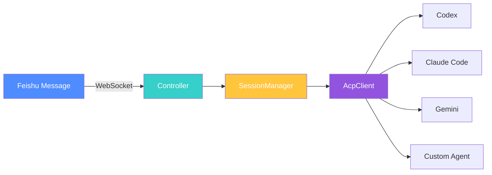

# ACP Claw


**An always-on AI coding assistant daemon that connects Lark/Feishu to any AI agent via ACP.**

English | [简体中文](./README.zh-CN.md)

---

## Why ACP Claw?

Traditional AI coding assistants require you to keep a terminal open, manually start sessions, and lose context between conversations. What if your AI agent could be **always on**, listening for your instructions from a messaging app you already use?

**ACP Claw** solves this by running as a long-lived daemon that:

- Listens to your Lark/Feishu messages 24/7
- Routes instructions to any ACP-compatible AI agent (Codex, Claude Code, Gemini, etc.)
- Maintains session persistence and memory across conversations
- Writes code, executes commands, reads/writes files — all from a chat message

No more context switching. Just message your agent and let it work.

---

## Features

- **Long-Live Looping** — Daemon mode that never sleeps; always ready for your next instruction
- **ACP Universal Adapter** — Connect to any agent that implements the [Agent Client Protocol](https://github.com/anthropics/agent-client-protocol)
- **Session Resume/Load** — Automatically reconnects sessions via `resume > load > create` fallback strategy
- **Multi-Session** — Run multiple sessions per user; create, switch, list, and delete sessions on the fly
- **Scheduled Tasks (Cron)** — Set up cron-based scheduled tasks to trigger agents automatically
- **Session Persistence** — Pick up conversations where you left off, even after restarts
- **Memory System** — Your agent remembers project context, decisions, and preferences
- **Reflexion Pipeline** — Auto-reflect on agent output for higher quality responses
- **Slash Commands** — Quick actions via `/` commands in chat
- **Multi-Agent Support** — Switch between different AI agents on the fly

---

## Supported Agents

| Agent | Command | Description |
|-------|---------|-------------|
| Codex | `npx @zed-industries/codex-acp` | Zed's Codex agent with ACP support |
| Claude Code | `npx @agentclientprotocol/claude-agent-acp` | Anthropic's Claude Code agent |
| Gemini | `gemini --acp` | Google's Gemini agent |
| Custom | Any executable with `--acp` flag | Bring your own ACP-compatible agent |

---

## Quick Start

### 1. Install

```bash
npm install -g acp-claw
```

### 2. Initialize

```bash
acp-claw init
```

This creates a `.acp-claw/` config directory in your project with default settings.

### 3. Configure

Edit `.acp-claw/config.yaml` to set your Lark/Feishu app credentials and choose your agent:

```yaml
feishu:
  app_id: "your-app-id"
  app_secret: "your-app-secret"

agent:
  command: "npx @agentclientprotocol/claude-agent-acp"
  working_dir: "/path/to/your/project"

session:
  persistence: true
  memory: true
```

### 4. Run

```bash
acp-claw run
```

Your daemon is now live! Send a message to your Feishu bot and watch the magic happen.

### Update

```bash
acp-claw update
```

---

## Architecture



**Data Flow:**

```
Feishu Message → WebSocket → Controller → SessionManager → AcpClient → Agent
     ↑                                                                    ↓
     └──────────────────── Response ←─────────────────────────────────────┘
```

---

## Slash Commands

| Command | Description |
|---------|-------------|
| `/help` | Show available commands |
| `/status` | Check daemon and agent status |
| `/agent <name>` | Switch to a different agent |
| `/session new` | Create a new session |
| `/session list` | List all sessions for current user |
| `/session switch <id>` | Switch to a specific session |
| `/session delete <id>` | Delete a session |
| `/restart` | Restart the ACP client connection |
| `/memory` | View current session memory |
| `/clear` | Clear current session context |
| `/language <en\|zh>` | Switch response language |

---

## Scheduled Tasks (Cron)

ACP Claw supports cron-based scheduled tasks that automatically trigger your agent at specified times.

### CLI Commands

```bash
# Add a scheduled task
acp-claw cron add --name "daily-standup" --schedule "0 9 * * 1-5" --prompt "Generate a standup summary"

# List all tasks
acp-claw cron list

# Enable/disable a task
acp-claw cron toggle --name "daily-standup" --enabled false

# Delete a task
acp-claw cron delete --name "daily-standup"
```

### Options

| Option | Description |
|--------|-------------|
| `--name` | Unique task name |
| `--schedule` | Cron expression (5-field format) |
| `--prompt` | Prompt sent to the agent when triggered |
| `--chat-id` | (Optional) Target chat for the response |
| `--one-shot` | (Optional) Auto-delete after first execution |

### Cron Expression Examples

| Expression | Meaning |
|-----------|---------|
| `*/5 * * * *` | Every 5 minutes |
| `0 9 * * *` | Daily at 9:00 |
| `0 9 * * 1-5` | Weekdays at 9:00 |
| `30 18 * * 5` | Every Friday at 18:30 |
| `0 0 1 * *` | First day of each month |

Tasks are persisted to `.acp-claw/scheduler/tasks.json` and survive restarts. Changes to the file are hot-reloaded automatically.

---

## Configuration

ACP Claw uses a YAML configuration file located at `.acp-claw/config.yaml`:

| Field | Type | Description |
|-------|------|-------------|
| `feishu.app_id` | string | Feishu app ID |
| `feishu.app_secret` | string | Feishu app secret |
| `agent.command` | string | ACP agent startup command |
| `agent.working_dir` | string | Working directory for the agent |
| `session.persistence` | boolean | Enable session persistence across restarts |
| `session.memory` | boolean | Enable memory system |
| `session.max_history` | number | Max messages to keep in session |

---

## Development

```bash
# Clone the repository
git clone https://github.com/IanYu-Tree/acp-claw.git
cd acp-claw

# Install dependencies
npm install

# Build
npm run build

# Run in development mode
npm run dev

# Run tests
npm test
```

---

## License

[MIT](./LICENSE) © IanYu
