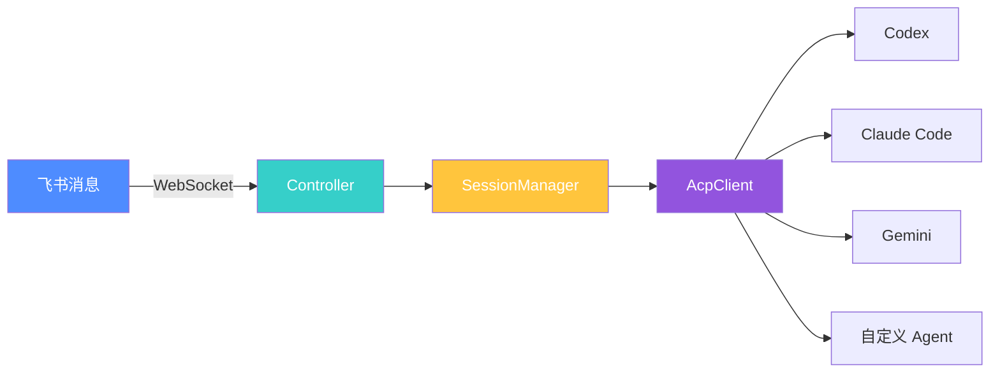

# ACP Claw


**永不下线的 AI 编程助手 —— 通过飞书消息驱动任意 AI Agent 写代码。**

[English](./README.md) | 简体中文

---

## 为什么需要 ACP Claw？

传统的 AI 编程助手有个共同的痛点：你得开着终端、手动启动会话，一旦关掉窗口就丢失了所有上下文。

**如果你的 AI 编程助手能像后台服务一样，7×24 小时待命，随时从聊天窗口接收指令呢？**

ACP Claw 就是为此而生的。它作为一个常驻守护进程运行：

- 实时监听飞书/Lark 消息，随时响应你的编程需求
- 通过 ACP 协议连接任意 AI Agent（Codex、Claude Code、Gemini 等）
- 跨会话保持记忆和上下文，重启也不丢失
- 直接帮你写代码、执行命令、读写文件 —— 你只管在聊天里说需求

不用再切换窗口，不用再管终端状态。发条消息，剩下的交给 Agent。

---

## 核心特性

- **长生命周期守护进程** — 后台常驻，永不休眠，随时待命
- **ACP 万能适配器** — 兼容任何实现了 [Agent Client Protocol](https://github.com/anthropics/agent-client-protocol) 的 AI Agent
- **Session 自动恢复** — 通过 `resume > load > create` 三级回退策略自动重连 session
- **多 Session 管理** — 支持每个用户同时运行多个 session，可创建、切换、列出、删除
- **定时任务 (Cron)** — 通过 cron 表达式设置定时任务，自动触发 Agent 执行
- **会话持久化** — 即使重启服务，也能无缝衔接之前的对话
- **记忆系统** — Agent 会记住你的项目背景、技术决策和偏好
- **Reflexion Pipeline** — 自动反思 Agent 输出，提升回答质量
- **斜杠命令** — 通过 `/` 命令快速控制 Agent 行为
- **多 Agent 切换** — 在不同的 AI Agent 之间自由切换

---

## 支持的 Agent

| Agent | 启动命令 | 说明 |
|-------|----------|------|
| Codex | `npx @zed-industries/codex-acp` | Zed 出品的 Codex Agent |
| Claude Code | `npx @agentclientprotocol/claude-agent-acp` | Anthropic 的 Claude Code Agent |
| Gemini | `gemini --acp` | Google 的 Gemini Agent |
| 自定义 | 任何支持 `--acp` 参数的可执行文件 | 接入你自己的 ACP Agent |

---

## 快速开始

### 1. 安装

```bash
npm install -g acp-claw
```

### 2. 初始化项目

```bash
acp-claw init
```

这会在你的项目目录下创建 `.acp-claw/` 配置目录，包含默认配置文件。

### 3. 配置

编辑 `.acp-claw/config.yaml`，填入飞书应用凭证并选择 Agent：

```yaml
feishu:
  app_id: "your-app-id"
  app_secret: "your-app-secret"

agent:
  command: "npx @agentclientprotocol/claude-agent-acp"
  working_dir: "/path/to/your/project"

session:
  persistence: true
  memory: true
```

### 4. 启动

```bash
acp-claw run
```

守护进程已启动！现在去飞书给你的 Bot 发条消息试试吧。

### 更新

```bash
acp-claw update
```

---

## 架构



**数据流向：**

```
飞书消息 → WebSocket → Controller → SessionManager → AcpClient → Agent
  ↑                                                                  ↓
  └──────────────────── 响应返回 ←───────────────────────────────────┘
```

---

## 斜杠命令

| 命令 | 说明 |
|------|------|
| `/help` | 显示可用命令列表 |
| `/status` | 查看守护进程和 Agent 状态 |
| `/agent <name>` | 切换到指定 Agent |
| `/session new` | 创建新 session |
| `/session list` | 查看当前用户所有 session |
| `/session switch <id>` | 切换到指定 session |
| `/session delete <id>` | 删除 session |
| `/restart` | 重启 ACP client 连接 |
| `/memory` | 查看当前会话记忆 |
| `/clear` | 清空当前会话上下文 |
| `/language <en\|zh>` | 切换响应语言 |

---

## 定时任务 (Cron)

ACP Claw 支持基于 cron 表达式的定时任务，到达指定时间时自动触发 Agent 执行。

### CLI 命令

```bash
# 添加定时任务
acp-claw cron add --name "daily-standup" --schedule "0 9 * * 1-5" --prompt "生成今日站会摘要"

# 列出所有任务
acp-claw cron list

# 启用/禁用任务
acp-claw cron toggle --name "daily-standup" --enabled false

# 删除任务
acp-claw cron delete --name "daily-standup"
```

### 参数说明

| 参数 | 说明 |
|------|------|
| `--name` | 任务名称（唯一标识符） |
| `--schedule` | Cron 表达式（5 字段格式） |
| `--prompt` | 触发时发送给 Agent 的提示词 |
| `--chat-id` | （可选）指定回复消息的聊天 ID |
| `--one-shot` | （可选）执行一次后自动删除 |

### Cron 表达式示例

| 表达式 | 含义 |
|--------|------|
| `*/5 * * * *` | 每 5 分钟 |
| `0 9 * * *` | 每天 9:00 |
| `0 9 * * 1-5` | 工作日 9:00 |
| `30 18 * * 5` | 每周五 18:30 |
| `0 0 1 * *` | 每月 1 号 0:00 |

任务数据持久化在 `.acp-claw/scheduler/tasks.json`，重启不丢失。文件修改后自动热重载。

---

## 配置说明

ACP Claw 使用 YAML 格式的配置文件，位于 `.acp-claw/config.yaml`：

| 字段 | 类型 | 说明 |
|------|------|------|
| `feishu.app_id` | string | 飞书应用 App ID |
| `feishu.app_secret` | string | 飞书应用 App Secret |
| `agent.command` | string | ACP Agent 的启动命令 |
| `agent.working_dir` | string | Agent 的工作目录 |
| `session.persistence` | boolean | 是否启用会话持久化 |
| `session.memory` | boolean | 是否启用记忆系统 |
| `session.max_history` | number | 会话中保留的最大消息数 |

---

## 本地开发

```bash
# 克隆仓库
git clone https://github.com/IanYu-Tree/acp-claw.git
cd acp-claw

# 安装依赖
npm install

# 构建
npm run build

# 开发模式运行
npm run dev

# 运行测试
npm test
```

---

## 开源协议

[MIT](./LICENSE) © IanYu
